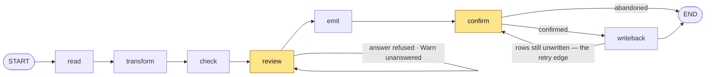

# Notion → Attio: the weekly handoff

Maya qualifies accounts in Notion and moves them into Attio once a week, by hand,
through a working spreadsheet. This is the argument for replacing the part of that
job the spreadsheet cannot reach, and the evidence for it.

The write-up and the source are the same link —
[`github.com/Qiuyi-Hong/notion2attioBackend`](https://github.com/Qiuyi-Hong/notion2attioBackend),
public, and open without an account or a credential of any kind. Every claim below is
checkable against files in this repo: the real workbook is
[`data/crm-handoff-working.xlsx`](data/crm-handoff-working.xlsx), and the batch is
the 8 rows of [`data/notion-source-seed.csv`](data/notion-source-seed.csv) that pass
the filter `Batch = 2026-W34` **and** `CRM status = Ready for CRM` — the same rows as
the export in
[`data/notion-qualified-accounts-w34.csv`](data/notion-qualified-accounts-w34.csv).
Every count drawn from the workbook or the batch is printed by `npm run w34:derive`,
which opens both files itself. Nothing is quoted from a ticket — and where a ticket and
the workbook disagree, this write-up follows the workbook and says so.

Detail lives behind links — ten [ADRs](docs/adr/), four
[research notes](docs/research/), and a committed
[worked example](docs/examples/handoff-2026-W34/) — so this stays short and the
evidence stays reachable.

---

## The job as it stands

The workbook's `Start here` tab lists six steps:

> 1. Filter the Notion database to `CRM status = Ready for CRM` and the current batch.
> 2. Export the filtered view as CSV.
> 3. Paste the exported rows into `Paste Notion Export`, beginning at A2. Keep the headers in row 1.
> 4. Review the generated rows in `Attio Upload`. Correct anything that looks wrong.
> 5. Search Attio, then create or update the company and person and add the company to Qualified accounts.
> 6. Once the batch is done, mark the source rows `Imported` in Notion.

The sheet automates 1–4 — the steps that were never hard. It stops dead at 5, where a
person searches Attio and creates records one at a time, and at 6, where she goes back
to Notion and marks each row by hand. It cannot help with either, and the reason is
structural: **a spreadsheet has nowhere to record the outcome of a human importing rows
into another system.**

The `Attio Upload` tab carries **700 formulas across 50 rows and 14 columns, with zero
drift** — every column is one shape, filled down. It is a well-kept sheet. That is the
problem: consistency across 50 rows is not correctness on 8.

## The transform is deterministic, and still wrong

`Attio Upload!C2`, the `Domain` column, verbatim:

```excel
=IF(B2="","",LOWER(SUBSTITUTE(SUBSTITUTE('Paste Notion Export'!C2,"https://",""),"www.","")))
```

It strips `https://` and `www.` and nothing else. Run it over the 8 real rows of batch
`2026-W34`, beside `S1`, the repair this pipeline makes instead — *lowercase; strip
scheme, `www.`, path, trailing `/`*:

| Source ID | Website | sheet `Domain` | `S1` repair | |
| --- | --- | --- | --- | --- |
| `QL-260818-001` | `https://www.northbeam.example.com/` | `northbeam.example.com/` | `northbeam.example.com` | **not a domain** |
| `QL-260818-002` | `https://oriel.example.com/uk` | `oriel.example.com/uk` | `oriel.example.com` | **not a domain** |
| `QL-260819-003` | `https://tern.example.com` | `tern.example.com` | `tern.example.com` | |
| `QL-260819-004` | `https://brightyard.example.com` | `brightyard.example.com` | `brightyard.example.com` | |
| `QL-260819-005` | `https://www.brightyard.example.com/` | `brightyard.example.com/` | `brightyard.example.com` | **not a domain** |
| `QL-260820-006` | `heliograph.example.com` | `heliograph.example.com` | `heliograph.example.com` | |
| `QL-260820-007` | `www.alderfinch.example.com` | `alderfinch.example.com` | `alderfinch.example.com` | |
| `QL-260820-008` | `https://lattice.example.com/` | `lattice.example.com/` | `lattice.example.com` | **not a domain** |

**Four of the eight outputs are not domains.** Three keep a trailing slash the formula
has no case for; one, Oriel, puts a URL path into a domain field.

One of the four costs a record. `QL-260819-004` and `QL-260819-005` are the same
account — Brightyard, two contacts, one opportunity, and the second row's own notes say
so: *"Treat this as a second contact at the existing account, not a second
opportunity."* The two websites differ only in `www.` and a trailing slash, and the
formula removes exactly one of the two. They land **one character apart**:
`brightyard.example.com` and `brightyard.example.com/`.

Attio matches Companies on `Domains`. So the sheet's output creates **8 companies from 8
source rows, where the batch contains 7.** Maya's current process creates two Brightyard
companies, and nothing in the sheet can tell her.

Two further gaps in the same formula are real but untriggered by this batch, so they are
stated as latent rather than shown: it handles `https://` and not `http://`, and
`SUBSTITUTE` replaces *every* occurrence of `www.`, anywhere in the string.

## The check catches one problem of four

`Attio Upload!O2`, the `Row check` column, verbatim:

```excel
=IF(B2="","",IF(F2="","CHECK","READY"))
```

`F` is the work email. That is the whole rule. On W34 it returns **7 `READY` and 1
`CHECK`** — Tern Mobility, whose contact has no work email. It is right, and it is the
only thing it can be right about.

It does not see that Brightyard is one account across two rows. It does not see that
Heliograph's notes say the contact *"previously spoke to the team under another email
address"*, or that Lattice Forge's say the contact *"replied from a newer email alias"* —
duplicate-person traps stated in prose and nowhere else. And it **cannot** see them,
because it marks a *source row*, and a row cannot say *one company, two people, one
opportunity*.

The column named `Import state` sits beside it, and it is worth reading the workbook
rather than any description of it — this one included. The brief for this write-up asked
for *"the `Domain` and `Import state` formulas quoted verbatim"*. **There is no
`Import state` formula to quote: the column has none, in any of the 50 rows, and every
cell in it is empty.** `Row check` is the column that computes readiness. Both facts are
read straight out of the `.xlsx` by `npm run w34:derive`, which fails if either changes.

The empty column is the better argument anyway, because it is the same structural fact
as step 5. A spreadsheet has nowhere to record the outcome of an import that happens in
another system, so the column that would have recorded it was never written. And the
readiness the sheet *can* compute — `Row check` — is computed from data that exists
before Attio is opened, so it is stale the moment the import runs.

So the same batch can be handed off twice. In Attio a Deal has **no unique attribute and
always creates**, with no undo ([research](docs/research/attio-csv-importer.md)). A
second handoff is a duplicate opportunity nobody can remove.

## What changes

**Candidates, not rows.** The pipeline splits a batch into Company, Person and Deal
**candidates** before any checking happens, keyed on the normalised domain and the work
email. Several rows can feed one candidate; one row feeds several. That is the unit that
can carry *one company, two people, one opportunity* — and the unit review happens on
([ADR-0001](docs/adr/0001-flags-attach-to-candidate-records.md)).

**A repair is not a judgement.** A change is a *silent repair* only when it is
deterministic, reversible, and asserts nothing new — it reformats a value already given.
Everything else is a **flag** the reviewer answers. Every repair is logged, and *silent*
means it does not need attention, not that it is hidden ([`CONTEXT.md`](CONTEXT.md)).

**Prove, or relay — never assert.** The pipeline never reads Attio. Brightyard is a
*proven* duplicate: both rows repair to one domain, and the evidence is in hand.
Heliograph and Lattice Forge are *suspicions* about records the pipeline has never seen,
so they reach the reviewer as notices to read, and change nothing.

**The confirmation closes step 6.** The reviewer downloads the bundle, imports it into
Attio by hand, and comes back — minutes or hours later, possibly at a different machine —
to confirm it landed. Only then does the pipeline write `CRM status = Imported` back to
Notion, and only on the source rows whose **every** candidate reached the CRM. Partial is
not finished, so `Imported` never overstates
([ADR-0005](docs/adr/0005-a-deal-is-emitted-only-when-its-account-is-clear.md),
[ADR-0007](docs/adr/0007-the-write-back-completes-or-is-abandoned.md)). That click is the
whole point: it is what stops a batch being handed off twice.

## What the reviewer sees


**This is a prototype, not the shipped screen** — Variant B of the three built to answer
[#10](https://github.com/Qiuyi-Hong/notion2attioBackend/issues/10), on branch
[`prototype/review-screen`](https://github.com/Qiuyi-Hong/notion2attioFrontend/tree/prototype/review-screen).
It is the primary source the real ledger was built from, and it runs over the real W34
batch, but it is a throwaway artefact and nothing in it is wired to the pipeline.

Four things in it carry the argument above. The header states the whole move in one line —
**source rows in, candidates out** — and the tables below it are grouped by the Attio
object each becomes, so what the reviewer reads matches what they will import. Brightyard
is one Company marked `2 rows merged`, where the sheet's formula makes two. The two
notices quote the research notes **verbatim** and say plainly what they are worth:
*nothing to change — this pipeline never reads Attio, so it can relay the note but cannot
check it*. And export is refused, with its reason, rather than failing on click.

Being a prototype costs it one number, and the cost is worth showing rather than
retouching: its header reads `21 candidates`, where the built pipeline derives **22** —
7 Company, 8 Person, 7 Deal, printed by `npm run w34:derive` and tabled below. The
prototype was drawn before the transform existed and nothing recomputes it. The rule
this write-up states elsewhere applies to its own figure: where the two disagree, the
derived output is right.

**There is no figure of the Notion write-back, and its absence is the point.** The obvious
second figure is `CRM status = Imported` on the seven rows — the column the spreadsheet
could never write, written. It is omitted because no real write-back has produced one, and
a screenshot of an import that did not happen is not a weaker figure than the real thing;
it is a fabricated one. The rule the two figures are held to is not the same, on purpose:
a prototype honestly labelled still answers *what shape is this surface*, while a
simulated write-back answers *did this work* with a lie. What it would take to produce it
is written down rather than left implicit — [the demo
narrative](docs/demo-narrative.md), beat 6.

## Where the model does not earn its place

The brief comes from a company that sells AI for sales, and the obvious move is to put a
model in the transform. **The transform does not want one, and the honest result is
mostly negative.** Full reasoning in
[ADR-0002](docs/adr/0002-a-model-may-only-raise-a-flag.md).

Five plausible jobs for a model. Four are closed by evidence:

- **Normalising the domain** — deterministic. Four characters of regex beat a model that
  cannot be replayed.
- **Splitting the person name** — Attio takes a single full-name column, so the split is
  never performed at all.
- **Summarising the notes into a CRM field** — Attio's importer *cannot import notes by
  CSV*, and the Attio API leg is out of scope. There is no field to write into.
- **Reading the notes to route Brightyard** — the note *corroborates* a fact the pipeline
  already proves from the shared domain. It supplies nothing.

**One job survives**, and it is the one deterministic rules cannot reach: reading free
prose for the two suspicions — an earlier contact under a different email address, and a
match with an earlier campaign. No honest regular expression generalises those.

So the pipeline ships **exactly one model call**, and its contract is narrow by
construction: a closed list of two kinds; a verbatim quote checked programmatically as an
exact substring of the source notes, with any suspicion whose quote does not match
discarded; no confidence score; a fixed reviewer-facing sentence, so the model selects
and never narrates; and the full `Research notes` always on screen whether or not a
notice was raised. A model can add attention. It cannot remove it.

**A model output is never a silent repair.** It is neither deterministic nor reversible,
and it asserts something the pipeline was not given. It can only raise a flag, and it
never writes a value the reviewer will send.

With no API key the run still completes, carrying a notice that the notes were not read.
A missing key never produces a batch that looks clean.

## What W34 actually produces

Re-derived by `npm run w34:derive` from the batch data:

| | candidates | exported | held |
| --- | --- | --- | --- |
| Company | 7 | 7 | 0 |
| Person | 8 | 7 | 1 |
| Deal | 7 | 6 | 1 |

All 7 Company candidates are exported, but only one of them needs a row of its own:
6 reach Attio through the relationship columns of `2-people.csv`. The *rows* of the
companies file are conditional in that way; the **file** is not, so every bundle holds
the same four members and a header-only companies file reads as *nothing needed one*
rather than as a file gone missing
([ADR-0010](docs/adr/0010-the-bundle-holds-the-same-file-set-every-week.md)). So the
bundle is `1-companies.csv` (1 row), `2-people.csv` (7 rows), `3-deals.csv` (6 rows)
and an inert `handoff-notes.md`. On confirmation, **7 of the 8 source rows** are marked `Imported`.

The held pair is the interesting case. Tern Mobility's contact has no work email, so the
Person candidate is Held. Its Deal is Held too, on a Stop naming the sibling that caused
it. That a Stop can come from a sibling is ordinary; what needs the argument is why it
reaches the Deal and not the Company, and the answer is that **only the irreversible
object waits**. A Company or a Person sent early upserts safely, and sending it twice is
a no-op; a Deal with an empty participants cell is a record attached to nobody,
permanently. So the *Company* still ships, in `1-companies.csv`, and the account is in
Attio the week it was qualified. The source row keeps `Ready for CRM` and returns when
W34 is re-run
([ADR-0003](docs/adr/0003-a-company-candidate-is-never-dropped-with-its-people.md),
[ADR-0005](docs/adr/0005-a-deal-is-emitted-only-when-its-account-is-clear.md)).

The full bundle for this batch is committed:
[`docs/examples/handoff-2026-W34/`](docs/examples/handoff-2026-W34/), including the
repair log and every flag with its answer.

One finding that changes nothing downstream but is worth Maya's time: `Employees` holds
**5 distinct values for 3 ranges** at source — `51–200` and `51-200`, `11–50` and
`11-50`, `201-500` — an en dash and a hyphen kept as separate Notion select options. The
pipeline does not emit `Employee range` at all ([why](docs/attio-workspace.md)), so
nothing breaks. The Notion database is still worth tidying.

## How it is built

Everything above is an argument about behaviour. This is the machine that produces it,
and it is deliberately small: two processes, one SQLite file, nineteen backend source
files and one graph.

### Two repositories, one origin

The backend is Express 5; the reviewer UI is React 19 on Vite, in
[a separate repository](https://github.com/Qiuyi-Hong/notion2attioFrontend) that holds
no pipeline logic. The Vite dev server proxies `/api` and `/auth` to port 3000, so **the
browser only ever talks to one origin** — there is no CORS configuration on either side
and no cookies at all. Every request the app makes is relative, so a built bundle served
by Express works unchanged, and `FRONTEND_ORIGIN` is the one place an origin is named.

`app.ts` is the whole of the wiring — body parsing, four routers, the error handler last.
`server.ts` does nothing but fail fast on a missing Notion client id or secret, then listen.

### The pipeline is a graph, compiled and run in-process

`graph.ts` compiles a seven-node LangGraph `StateGraph` over a Zod `StateSchema` and
`.invoke()`s it **inside the Express process**. There is no LangGraph Platform and no
`@langchain/langgraph-sdk`: the run identifier is the `thread_id`, and the SQLite
checkpoint is the whole read model.



The two shaded nodes are the human pauses. Three edges are conditional, and each is a
rule from the argument above rather than plumbing:

- **`review → review`**, while an answer was refused or any Warn is unanswered. The
  refusal is the run *staying where it is*, not a `400` on a response the reviewer will
  never see again — the problem appears on the candidate in the ledger they are already
  working in, and nothing they got right is lost.
- **`confirm → END`**, when the reviewer abandons: the bundle reached Attio and they are
  giving up on marking Notion. Confirming is the only path into the one node that writes.
- **`writeback → confirm`**, while any handed-off row is still unwritten. **That edge is
  the entire retry mechanism** — no second pause, no second route, re-entered by the same
  payload on the same endpoint, and re-entering costs nothing because the node re-queries
  Notion before it writes ([ADR-0007](docs/adr/0007-the-write-back-completes-or-is-abandoned.md)).

Both `interrupt()` calls sit in nodes that do nothing else. An interrupted node re-runs
from the top on resume, so a side effect there would be charged again on every resume —
which is also why the single model call lives in `check`, *before* the pause, rather than
in `review`. Screened there, the same run shows the same notices every time it is looked at.

### The state is the read model, and status is derived

`store.ts` keeps three columns per run — identifier, batch, creation time — and nothing
else. Every candidate, flag, repair and emitted byte lives in the graph checkpoint
([ADR-0009](docs/adr/0009-the-server-keeps-its-own-record-of-runs.md)). Nothing is stored
twice, so nothing can disagree.

A run's status is likewise never stored. It is read off the checkpoint on **every**
request, so it cannot lie about what is happening:

| Status | Read from |
| --- | --- |
| `running` | the in-process working set |
| `failed` | the in-process thrown set |
| `abandoned` | `state.abandoned` — an abandoned run and a `done` one both reached `END`, and only `done` releases the batch |
| `awaiting_review` | a pending task carrying interrupts, named `review` |
| `awaiting_confirmation` | the same, named `confirm` — reached the moment the files **exist**, not when they are downloaded |
| `stalled` | no checkpoint yet, or pending work with no interrupt |
| `done` | nothing pending |

One read serves both the status and the ledger, so the two cannot come from two different
moments of a live thread.

### The seven stages, and the rule each is held to

| Node | Module | What it does | The rule |
| --- | --- | --- | --- |
| `read` | `notion.ts` | Finds the shared data source, queries the batch rows, stamps the workspace onto the run | Stamped by the node that queried, not at run creation: `POST /api/runs` answers `202` and the Connection can be replaced first ([ADR-0008](docs/adr/0008-a-run-is-confirmed-only-through-the-connection-that-read-it.md)) |
| `transform` | `candidates.ts` | Source rows become Company, Person and Deal candidates, deduplicated on the repaired domain and the work email — one Deal per Company, never per row | Every normalisation is written to the repair log; anything that would create, merge or discard a candidate is a flag instead |
| `check` | `flags.ts`, `screener.ts` | The deterministic rules, and the one model call, over the proposed ledger | The candidate set and the flag set are frozen the moment it returns ([ADR-0004](docs/adr/0004-the-candidate-set-is-frozen-at-the-check-pass.md)) |
| `review` | `review.ts` | Applies the reviewer's Decision — answers, holds and sparse edits | Structural nonsense is a `400` at the edge; semantic refusal comes back marked on the flag that was answered |
| `emit` | `emit.ts` | Three RFC-4180 CSVs in dependency order plus `handoff-notes.md`, packed by a hand-rolled ZIP writer and hashed into stable file ids | It runs here rather than at download: a `GET` free to regenerate the files would be free to disagree with the ledger that was on screen |
| `confirm` | — | Holds the second `interrupt()`, and nothing else | It is reached a second time after a partial write-back, carrying the failure list — which is what turns the confirmation panel into a retry panel |
| `writeback` | `writeback.ts` | Re-queries Notion for rows still `Ready for CRM` and marks the fully-exported ones `Imported`, with rate-limit-aware retries | The only external mutation in the system. Every failure is a closed-list Cause on run state, never an HTTP error |

### The flags, in full

The whole flag vocabulary, and its being closed is the point — a flag exists only if the
reviewer can act on it.

| Rule | Level | Sits on | What it says |
| --- | --- | --- | --- |
| `B1` | Stop | Person | No work email. The reviewer may override it |
| `W1` | Warn · decision | Deal | More than one Person on this account — which contact the Deal belongs to |
| `D1` | Stop | Deal | A sibling in this account is not Clear. Names the sibling, is cleared by completing the account, and is the one flag with no way to force past it ([ADR-0005](docs/adr/0005-a-deal-is-emitted-only-when-its-account-is-clear.md)) |
| `N1` · `N2` · `N1+N2` | Warn · notice | Person | The screener's two suspicion kinds, carrying a verbatim quote. Nothing to change — one flag is one *problem*, so both kinds on one person are one notice |
| `P1+P2` | Warn · decision | Batch | `Deal owner` and `Deal stage`, asked once, in one place, before the files are made |
| `N0` | Warn · notice | Batch | No API key, so nothing read the notes. A missing key never produces a batch that looks clean |

A candidate's state is read off its flags and holds — never typed in. `flags.ts` derives
the held cascade in one place: a candidate is Held for its own Stop, the reviewer's hold,
or its Company's condition.

### The I/O boundary

Every stage above delegates its outside-world contact to exactly two modules, and the
pipeline crosses the boundary nowhere else.

`notion.ts` owns the whole Notion REST surface — the OAuth authorize URL, code exchange
and token revocation (Basic auth, pinned `Notion-Version`), data-source discovery via
search, paginated batch queries, and `markImported`.

`store.ts` owns one SQLite file, opened through **`node:sqlite`** — no ORM and no driver
dependency. Three tables, and LangGraph's checkpoint tables beside them in the same file,
so a deployment has one artefact to back up and any cleanup is per-table:

| Table | Holds |
| --- | --- |
| `connection` | One row, enforced by `CHECK (id = 1)`: the Notion token response and when it was granted |
| `pending_authorisation` | One-shot OAuth `state` values with a TTL, spent on callback |
| `runs` | `run_id`, `batch`, `created_at` — the recovery index, so a run whose link was lost is still findable |

### The HTTP surface

Thirteen endpoints across four routers, and one error envelope —
`{ "error": { "code", "message", "details" } }` over a closed list of eight codes:
`not_connected`, `wrong_workspace`, `no_such_run`, `no_such_file`, `wrong_stage`,
`batch_in_progress`, `invalid_payload`, `notion_failed`.
[`docs/http-contract.md`](docs/http-contract.md) is authoritative and **stays**
authoritative where the code disagrees — a mismatch is a bug in the code, not in the spec.

| Endpoint | What it does |
| --- | --- |
| `GET /auth/notion/start` | Opens a one-shot pending authorisation and redirects to Notion's consent screen |
| `GET /auth/notion/callback` | Claims the state, exchanges the code, saves the Connection, redirects back with a named outcome |
| `GET /api/connection` | Names the connected workspace — never the token, never the ids |
| `DELETE /api/connection` | Names the runs it will strand awaiting confirmation, then revokes the grant and drops the row |
| `GET /api/batches` | The batches with rows waiting for the CRM and their ready counts, proving the filter runs against the live workspace |
| `POST /api/runs` | Starts a run — `202` with the run id, or `409 batch_in_progress` naming the run that already holds it |
| `GET /api/runs` | Every run with its derived status |
| `GET /api/runs/:runId` | One run's full snapshot, read from the checkpoint |
| `POST /api/runs/:runId/review` | The first pause: a Zod-validated Decision, answering with the resulting ledger |
| `POST /api/runs/:runId/confirm` | The second pause: the attestation that the batch landed, triggering the write-back |
| `GET /api/runs/:runId/files/:fileId` | One handoff file's stored bytes, served as an attachment and never regenerated |
| `POST /api/runs/:runId/continue` | Resumes a stalled or failed run — `202`, or `409 wrong_stage` |
| `DELETE /api/runs/:runId` | Cancels a run. Once files exist this is the attestation that they did **not** reach Attio |

### The reviewer UI

The dependency list is `react` and `react-dom`, and that is all of it. No router —
`router.ts` is `history.pushState` plus `popstate` exposed to React through
`useSyncExternalStore`. No state library and no data-fetching library: `api.ts` is one
`request` wrapper, an `ApiError` carrying the server's code, and the wire types.

Four screens, and beside three of them a **pure rules module with its own assertion
self-check**, so the reading a screen does is testable without a browser:

| Screen | Pure rules | Self-check |
| --- | --- | --- |
| `RunsIndex.tsx` — the front door | `runs.ts` — status to label, tone and one action; the sort that puts whatever needs a human first | `runs.check.ts` |
| `Ledger.tsx` — the first pause | `ledger.ts` — candidate state, the rows behind a company, unanswered Warns, the export gate | `ledger.check.ts` |
| `Confirm.tsx` — the second pause | `confirm.ts` — which files are offered and in what order, what disables Confirm and why, the retry panel, the abandon rule | `confirm.check.ts` |
| `RunPage.tsx` | polls the snapshot and picks a layout per status | — |

`npm run check` runs all three as `node src/*.check.ts`, with no test framework.

The line those modules hold is worth naming: **the client never re-derives what the
server decided.** `ledger.ts` reads candidate state and the export gate, and pointedly
does not recompute the hold cascade — that reading has one home, in `flags.ts`, and two
homes is how a ledger starts disagreeing with the files it produced.

### What is not in the dependency list

Nine backend runtime dependencies: Express, the three `@langchain/*` packages, Zod,
`uuid`, `dotenv`, `body-parser` and `path`. Nothing else, and the absences are choices:

- **No ORM and no SQLite driver** — `node:sqlite` ships with Node.
- **No CSV library** — `emit.ts` writes RFC-4180 through one `csv()` helper, so there is
  exactly one place a delimiter or a line ending can be wrong. The bytes are pinned
  against Attio's own six templates.
- **No ZIP library** — a hand-rolled, store-only writer.
- **No OpenAI SDK** — the single model call is one `fetch` to `/v1/responses`, so the
  closed-list schema, the two-kind enum and the quote check are all visible in
  `screener.ts` rather than behind a client.

### How the whole thing is checked

`npm test` runs Node's own test runner over ten suites — 147 tests — with `notion-fake.mjs` and
`model-fake.mjs` standing in for the two external services and `fresh-process.mjs` for
the suites that need module state reset. `handoff-example-bytes.test.mjs` holds the
committed W34 bundle to the byte. No token, no network.

`npm run w34:derive` re-derives every number in this write-up from the workbook and the
batch, and fails if any of fifteen claims stops being true.

## Stated as untested, because it is untestable

**There is no Attio workspace, and one cannot be created.** Attio's signup rejects
personal email domains and requires a work email, and the restriction is documented
nowhere in their help centre. Three questions were re-settled from primary sources
instead of by experiment ([full account](docs/attio-workspace.md)):

- **The byte format is settled by observation, firmly.** Attio publishes six downloadable
  CSV import templates; `npm run attio:templates` downloads and inspects all six, and they
  agree unanimously — UTF-8, no BOM, CRLF, comma-delimited, RFC-4180 quoting, no trailing
  newline. Raw evidence in [`docs/attio-template-bytes.json`](docs/attio-template-bytes.json).
- **`Primary location` from a bare city is untested.** Attio's template shows
  `"City, State, Country"` (`San Francisco, CA, USA`); Notion holds `London`, `Bristol`.
  Whether Attio resolves a bare city is unknown and unknowable without a workspace. If it
  does not, the cell is dropped and nothing else breaks.
- **The real `Deal stage` labels are untested.** `Lead` is taken from Attio's published
  template, not from a live workspace. The labels must be confirmed before the first real
  import.

The probe harness for all of this is written and parked, not deleted
([`data/attio-probes/`](data/attio-probes/)). Anyone with a work email address settles
the open questions empirically in about five minutes with `npm run attio:setup`.

## Decisions, taken as decisions

Each of these is a gap made on purpose, with a reason. None is an oversight.

**The Attio write leg is out of scope.** The pipeline never reads or writes Attio; the
reviewer imports by hand and attests that it landed. That is what makes confirmation an
*attestation* rather than an observation, and it is why `CRM company ID` and
`CRM person ID` in Notion stay empty for ever. Adding the API leg is the single change
that would close the most gaps below.

**`Research notes` reach nobody.** Attio cannot import notes by CSV, so the prose is read
for flags and then dropped — where Maya pastes it into Attio by hand today. This is a
genuine **regression against the manual process**, not a neutral trade, and it is stated
as one. The stopgap is `handoff-notes.md`, which carries every note for the reviewer to
paste; the fix is the Attio API leg.

**A unique Deal `Source ID` is the right production answer, and is not shipped.** Deals
have no natural unique attribute, so Attio always creates them; a `Source ID` marked
unique in Attio would be a real key and would defuse the duplicate-deal problem outright.
It requires a schema change to a workspace that does not exist and cannot be tested.
Shipping an untestable schema dependency, to solve a problem the confirmation step already
defends against, trades a real risk for a theoretical one.

**The OAuth token is plaintext at rest.** One row in the SQLite file, single tenant, no
encryption. In production it is encrypted under a managed key or held in a secrets
manager. It is stored rather than kept in memory because a run survives a restart, and a
connection that did not would fail at the last step of the flow — the write-back, hours
later.

**Concurrency is single-process.** The in-process lock and the stage guard both assume one
Express process; two would each accept a resume. Only the write node's re-query of Notion
survives that. A real deployment puts the lock in the database.

**There is no authorisation.** A run identifier is a v4 UUID in a URL, and possession of it
is the entire access-control story. In production a connection belongs to a user and every
run is authorised against its owner, so the identifier stops being a bearer capability.
This is precisely why the app stays on localhost.

Two smaller ones, for completeness: rate limiting and retry against Notion are out of
scope, and a confirmation is taken at face value — nothing detects a reviewer who clicks
Confirm before the import finished. That last one is the residue of choosing a human
attestation over a signal that cannot be obtained, not an oversight.

## The decision record

| Where | What it settles |
| --- | --- |
| [`CONTEXT.md`](CONTEXT.md) | The vocabulary — batch, run, candidate, flag, silent repair, confirmation, write-back |
| [ADR-0001](docs/adr/0001-flags-attach-to-candidate-records.md) | Flags attach to candidates, not source rows |
| [ADR-0002](docs/adr/0002-a-model-may-only-raise-a-flag.md) | A model may only raise a flag — the negative result above |
| [ADR-0003](docs/adr/0003-a-company-candidate-is-never-dropped-with-its-people.md) | A Company candidate is never dropped with its people |
| [ADR-0004](docs/adr/0004-the-candidate-set-is-frozen-at-the-check-pass.md) | The candidate set is frozen at the check pass |
| [ADR-0005](docs/adr/0005-a-deal-is-emitted-only-when-its-account-is-clear.md) | A Deal is emitted only when its whole account is Clear |
| [ADR-0006](docs/adr/0006-a-repeat-deal-for-a-known-account-is-not-a-duplicate.md) | A repeat deal for a known account is not a duplicate |
| [ADR-0007](docs/adr/0007-the-write-back-completes-or-is-abandoned.md) | The write-back completes or is abandoned |
| [ADR-0008](docs/adr/0008-a-run-is-confirmed-only-through-the-connection-that-read-it.md) | A run is confirmed only through the connection that read it |
| [ADR-0009](docs/adr/0009-the-server-keeps-its-own-record-of-runs.md) | The server keeps its own record of runs, so a lost link is recoverable |
| [ADR-0010](docs/adr/0010-the-bundle-holds-the-same-file-set-every-week.md) | The bundle holds the same file set every week — amends ADR-0003 |

**Specifications** — [the handoff bundle](docs/handoff-files.md),
[the HTTP contract](docs/http-contract.md), [the run surfaces](docs/run-surfaces.md),
[the Notion source database](docs/notion-source-database.md),
[the Notion connection](docs/notion-oauth-connection.md),
[what the Attio docs don't say](docs/attio-workspace.md),
[the demo narrative](docs/demo-narrative.md).

**Research** — [Attio's CSV importer](docs/research/attio-csv-importer.md),
[human-in-the-loop in LangGraph.js](docs/research/langgraph-hitl.md),
[Notion OAuth](docs/research/notion-oauth.md),
[the Notion query API](docs/research/notion-query-api.md).

## Re-deriving every number

```
npm run w34:derive     # every count above, from the batch data
npm run notion:check   # the fixture the first one reads
```

The first opens the `.xlsx`, quotes the sheet's own two formulas, runs them over the
batch beside the pipeline's repair, derives the candidate counts, and self-checks
fourteen claims this write-up makes — including that the quoted formulas are the
workbook's byte for byte, and that `Import state` is empty. No token, no network. If a
number here disagrees with that output, the output is right.

## State of the build

The argument above stands on the workbook, the batch, the decision record and the
committed worked example. All four are in this repo now.

The graph is compiled and run inside the Express process, and both of its interrupts
are reached: **read → transform → check → *review* → emit → *confirm* → writeback**.
The stages and the edges between them are laid out in
[How it is built](#how-it-is-built) above.
A run reads its batch from the connected Notion workspace, pauses for the Reviewer,
emits the bundle, pauses again for the confirmation, and writes `CRM status` back to
Notion. The frontend lives in a separate repository and holds no pipeline logic — it
renders the runs index, the run in flight, the ledger, and the confirmation inline
beneath it.

**The demo is not a link the assessor can click, and it is not meant to be.** It runs
on `localhost` against our own Notion workspace, driven by us — there is no
authorisation to put a public deployment behind, which is stated above as a decision
rather than a shortfall, and the source database has a schema an arbitrary workspace
will not have. What it shows, in what order, and the one step it cannot perform, are
settled in [the demo narrative](docs/demo-narrative.md).

So the demo is supporting evidence for this write-up rather than the other way round.
If it is unreachable, nothing above stops being checkable: the workbook, the batch,
the decision record and the committed worked example are all in this repo, and
`npm run w34:derive` re-derives every number without a token or a network.
